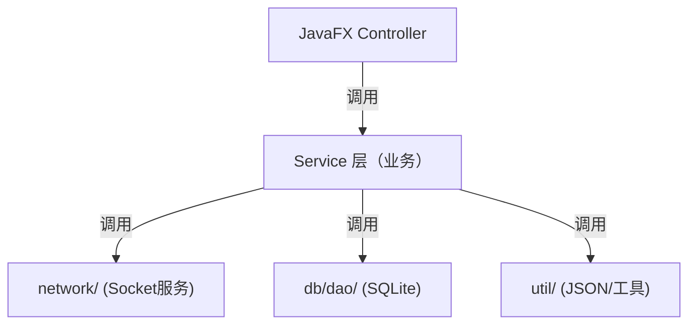
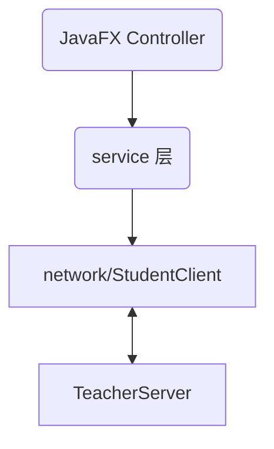

# 线上考试系统

## 业务逻辑

### 教师端
学校或组织使用一台性能较好的服务器
1. 登录/身份验证
2. 创建考试
   - 开始/结束时间
   - 添加题目（选择/填空/判断）
   - *添加答案（用于自动评阅）
3. *考试前接收学生的报名信息
4. 考试中与学生连接
5. 广播考试开始
6. 接收学生答案
7. 查看考试状态
8. *自动评阅/手动更正
9. *导出成绩

### 学生端
1. 登录+填写个人信息
2. 连接到教师端 & 考试报名
3. 接收试题
4. 提交前答案本地保存
5. 提交答案
6. 异常处理（自动重连）

## 项目整体架构

分为教师端和学生端两个子项目：
```
ExamSystem/
 ├── teacher-app/   教师端
 └── student-app/   学生端
```

教师端：
```
teacher-app/
 ├── java/
 │   ├── controller/        
 │   ├── view/              
 │   ├── model/             
 │   ├── network/           
 │   ├── db/               
 │   ├── service/      
 │   └── util/        
 └── resources/
     ├── fxml/
     ├── css/
     └── icons/

```

学生端：
```
student-app/
 ├── java/
 │   ├── controller/
 │   ├── view/
 │   ├── model/
 │   ├── network/ 
 │   ├── service/
 │   └── util/
 └── resources/
     ├── fxml/
     ├── css/
     └── icons/
```

## 技术栈
- Java 21
- JDBC + SQLite 数据库
- 多线程
- Socket + Java IO 网络通信 (JSON)
- JavaFX 界面
- 教师端作为 Host, 无独立服务器

## 功能概述

### 教师端
- controller: UI 控制层
  - 主界面
  - 创建考试
  - 查看在线学生
  - 实时监控
  - 阅卷模块
- view: 界面布局文件
  - FXML
  - CSS
  - 图标资源
- model: 数据模型
  - 考试
  - 题目
  - 学生信息
  - 学生连接状态
  - 网络通信的消息结构
- network: 网络通信模块
  - TeacherServer
    - 开启监听
    - 保存客户列表
    - 广播消息
  - ClientHandler
    - 负责单个学生连接
    - 接收学生信息
    - 发送考试题目
    - 接收学生答案
    - 网络异常处理
- db: 数据库模块
  - DAO模式：数据库逻辑与业务分离
- service: 业务逻辑层
  - 创建考试
  - CRUD题目
  - 维护学生状态
  - 保存批改答案
  - 推送消息
- util: 工具类
  - JSON序列化/反序列化
  - 时间工具
  - 日志工具

### *学生端
与教师端类似，但不包含数据库，一个Socket单线程，消息协议与教师端一致。

- network
  - 连接教师端IP
  - 发送登录信息
  - 接收试题
  - 提交答案

（待细化）

## 状态存储设计

### SQLite
- 考试信息
- 题目
- 提交的答案
- 学生信息（成绩）

*初步设计三张表，试卷信息，题目，学生作答（待细化）

### 教师端内存
- 在线学生列表
- 每个学生连接的Socket

### 学生端本地
- 当前试题
- 已作答未提交的答案
- 学生信息
- Socket连接状态

## 服务连接

### 教师端



### 学生端



## *通信协议
 
（使用JSON, 具体形式待定）

